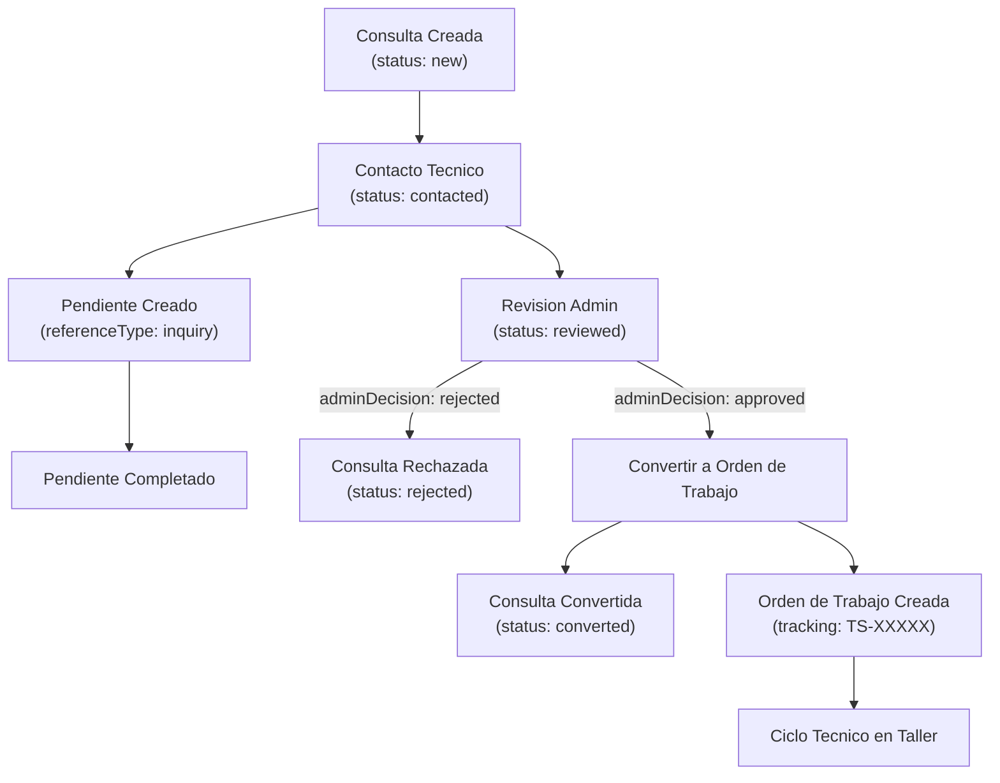

# Flujo 01: Consulta -> Pendiente -> Orden de Trabajo

Conecta el primer contacto del cliente (`Inquiry`), la gestion de tareas
intermedias (`PendingItem`) y la ejecucion tecnica en el taller
(`WorkOrder`).

## 1. Consulta (Inquiry) - Recepcion y Diagnostico Previo

`Inquiry` representa el primer contacto de un cliente. Modelo en
`inquiry.interfaces.ts:1`.

**Importante:** el modelo distingue dos campos:

- `status: InquiryStatus` (`inquiry.interfaces.ts:9`) - controla que
  muestra la UI. Valores activos: `new`, `contacted`, `reviewed`. Los
  terminales `APPROVED`, `REJECTED`, `CONVERTED` los asigna el backend
  en la respuesta.
- `adminDecision: InquiryDecision` (`inquiry.interfaces.ts:20`) - campo
  independiente con su propio enum (linea 61):
  `PENDING | APPROVED | REJECTED`. Es el que decide si se habilita el
  boton "Convertir" (`inquiry-detail.component.ts:85`):
  `status === 'reviewed' && adminDecision === 'approved'`.

| Etapa | `status` | `adminDecision` | Campos clave del modelo |
|---|---|---|---|
| Recepcion | `new` | `pending` (default) | `clientName`, `clientPhone`, `clientEmail`, `clientAddress`, `source`, `description` |
| Contacto tecnico | `contacted` | `pending` | `technicianNotes`, `estimatedCost`, `estimatedDuration`, `materialsNeeded`, `recommendation` (via `ContactInquiryDto`) |
| Revision admin | `reviewed` | `pending` | preparacion para decision |
| Aprobada | `approved` | `APPROVED` | `reviewedAt`, `adminNotes` |
| Rechazada | `rejected` | `REJECTED` | `reviewedAt`, `adminNotes` |
| Convertida (terminal) | `converted` | irrelevante | `workOrderId` asignado (linea 22) |

Acciones del servicio (`inquiries.service.ts`):

- `contact(id, dto)` - linea 48. POST a `/api/inquiries/:id/contact`.
- `review(id, { adminDecision, adminNotes? })` - linea 52. POST a
  `/api/inquiries/:id/review`.
- `convert(id, clientId, serviceTypeId)` - linea 56. POST a
  `/api/inquiries/:id/convert`.

## 2. Pendiente (Pending Item) - Vinculacion parcial con Consultas

`PendingItem` es un recordatorio operativo asignado a un usuario.
Modelo en `pending-item.interfaces.ts:1`.

- `PendingItemType` (linea 26):
  `work_order | inquiry | maintenance | follow_up | other`.
- `PendingItemStatus` (linea 41):
  `pending | in_progress | completed | cancelled`.

**El modelo permite la vinculacion** (`referenceType: string`,
`referenceId: string`, lineas 9-10), y `notification.utils.ts:29,54`
filtra notificaciones por `referenceType === 'inquiry'`.

**⚠️ Gap actual:** el feature `inquiries` **no importa ni usa**
`pending-items.service`. El formulario de creacion
(`pending-item-form.component.ts:182-188`) no setea `referenceType`
ni `referenceId`; el `type` por defecto es `WORK_ORDER` (linea 159).
La vinculacion queda solo en el backend o en un formulario independiente
donde el operador selecciona el tipo `INQUIRY` y completa `referenceId`
manualmente (campo no expuesto en el form).

## 3. Conversion: de Consulta a Orden de Trabajo (convert)

Cuando `status === 'reviewed' && adminDecision === 'approved'`
(`inquiry-detail.component.ts:85`), se renderiza el boton
"Convertir a Orden de Trabajo".

Al ejecutarse `inquiriesService.convert(id, clientId, serviceTypeId)`
(`inquiries.service.ts:56`), el backend:

1. Crea la `WorkOrder` formal. El modelo (`work-order.interfaces.ts:14`)
   requiere `client` (no `clientId` en el GET; en `CreateWorkOrderDto`
   si es `clientId`) y `serviceType` (identico). Asigna `trackingCode`
   formato `TS-XXXXX` (decidido en AGENTS.md; el formato lo genera el
   backend).
2. Actualiza la `Inquiry`: `status -> CONVERTED` y persiste
   `inquiry.workOrderId = workOrder.id` (linea 22 del modelo).
3. Cierre de pendientes: a confirmar con backend; el frontend no tiene
   logica que migre `referenceType` de `'inquiry'` a `'work_order'`
   tras la conversion.

**⚠️ Bug conocido:** la implementacion actual del componente
(`inquiry-detail.component.ts:301`) invoca
`inquiriesService.convert(inquiry.id, '', '')` con strings vacios
como `clientId` y `serviceTypeId`. No hay selector en la UI para
elegirlos. Pendiente: o el backend resuelve por defecto, o falta un
dialogo previo al convert.

## 4. Orden de Trabajo (Work Order) - Ejecucion

Una vez convertida, la `WorkOrder` entra al flujo tecnico del taller.
Modelo en `work-order.interfaces.ts:1`. Ver flujo detallado en
[02-workorder-lifecycle.md](./02-workorder-lifecycle.md).

## Referencias en codigo

| Paso del flujo | Ubicacion |
|---|---|
| Modelo `Inquiry` + enums | `src/app/core/models/inquiry.interfaces.ts:1` |
| `status` field | `src/app/core/models/inquiry.interfaces.ts:9` |
| `adminDecision` field | `src/app/core/models/inquiry.interfaces.ts:20` |
| `workOrderId` field | `src/app/core/models/inquiry.interfaces.ts:22` |
| `InquiryStatus` enum | `src/app/core/models/inquiry.interfaces.ts:44` |
| `InquiryDecision` enum | `src/app/core/models/inquiry.interfaces.ts:61` |
| `ContactInquiryDto` | `src/app/core/models/inquiry.interfaces.ts:97` |
| Accion `contact(id, dto)` | `src/app/core/services/inquiries.service.ts:48` |
| Accion `review(id, dto)` | `src/app/core/services/inquiries.service.ts:52` |
| Accion `convert(id, clientId, serviceTypeId)` | `src/app/core/services/inquiries.service.ts:56` |
| Vista detalle + boton "Convertir" | `src/app/features/inquiries/inquiry-detail.component.ts:1` |
| Condicion boton Convertir | `src/app/features/inquiries/inquiry-detail.component.ts:85` |
| Llamada `convert` con strings vacios (bug) | `src/app/features/inquiries/inquiry-detail.component.ts:301` |
| Modelo `PendingItem` + enums | `src/app/core/models/pending-item.interfaces.ts:1` |
| `PendingItemType` enum | `src/app/core/models/pending-item.interfaces.ts:26` |
| `PendingItemStatus` enum | `src/app/core/models/pending-item.interfaces.ts:41` |
| Form crear pendiente (sin referenceType) | `src/app/features/pending-items/pending-item-form.component.ts:182` |
| Filtrado de notificaciones por inquiry | `src/app/core/utils/notification.utils.ts:29` |
| Modelo `WorkOrder` + `WorkOrderStatus` | `src/app/core/models/work-order.interfaces.ts:1` |
| Componente transicion de status | `src/app/features/work-orders/status-transition.component.ts:1` |
| Resolver de detalle (carga previa) | `src/app/features/work-orders/work-order.resolver.ts:1` |
| Consumo de WebSocketService en detalle | `src/app/features/work-orders/work-order-detail.component.ts:6` |
