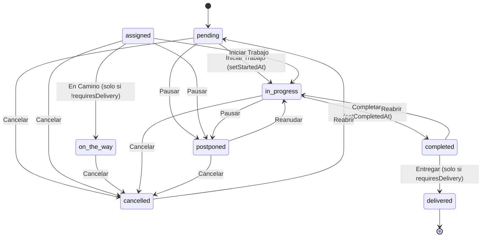

# Flujo 02: Ciclo de vida de la Orden de Trabajo

La `WorkOrder` (WO) es la unidad central del sistema: agrupa cliente,
servicio, tecnicos, materiales, notas, tareas, pagos y facturacion
asociados a un trabajo tecnico. Su ciclo de vida va desde la creacion
(hasta `pending`) hasta la entrega (`delivered`) o cancelacion
(`cancelled`).

## Estados (modelo)

`WorkOrderStatus` definido en `work-order.interfaces.ts:1-9`:

```
'pending' | 'assigned' | 'on_the_way' | 'in_progress'
| 'postponed' | 'completed' | 'delivered' | 'cancelled'
```

**⚠️ Discrepancia detectada:** el codigo real **no coincide** con el
ciclo descrito en disenos previos
(`RECEIVED -> DIAGNOSING -> BUDGETED -> APPROVED -> IN_PROGRESS -> READY
-> DELIVERED`). Resolver con el equipo / backend antes de renombrar.
El componente `status-transition.component.ts:1` consume los literales
actuales (`pending`, `assigned`, etc.) directamente.

## Diagrama de estados



**Dimension clave: `requiresDelivery`** (boolean, viene de
`serviceType.requiresDelivery`, definido en
`service-type.interfaces.ts:7`, default `false`).

- Si `!requiresDelivery` y `status === 'assigned'`: el componente
  muestra "En Camino" (`on_the_way`) **en lugar de** "Iniciar Trabajo"
  (`status-transition.component.ts:128-141`).
- Si `!requiresDelivery`: se filtra la accion "Entregar"
  (`status-transition.component.ts:142-144`); el trabajo termina
  directamente en `completed`.

Esto modela la diferencia entre **servicios en taller** (cliente deja
el equipo, requiere `delivered` para devolver) y **servicios a
domicilio** (tecnico va, hace el trabajo, lo entrega en sitio).

## Actores y relaciones

| Campo | Tipo | Fuente |
|---|---|---|
| `sellerId?` | string | `work-order.interfaces.ts:27` - rol `seller` |
| `technicians` | `{ id, name }[]` M2M | `work-order.interfaces.ts:46` |
| `serviceType` | `{ id, name, requiresDelivery? }` | `work-order.interfaces.ts:41-45` |
| `priority` | `low` \| `medium` \| `high` \| `urgent` | `work-order.interfaces.ts:10` |
| `location` | `on_site` \| `workshop` | `work-order.interfaces.ts:11` |
| `statusLog` | `WorkOrderStatusLog[]` | `work-order.interfaces.ts:150` |

Asignacion de tecnicos: dialogo dedicado en
`technician-assignment-dialog.component.ts:1` (M2M, soporta
asignar/desasignar varios tecnicos a la vez).

## Acciones disponibles por estado

Matriz `ACTIONS_BY_STATUS` definida en
`work-order.status-transition.component.ts:22-67`. Cada accion tiene
un `label`, un `nextStatus` y opcionalmente un efecto colateral
(setear `startedAt` o `completedAt`).

| Estado actual | Acciones (labels UI) |
|---|---|
| `pending` | Iniciar Trabajo, Pausar, Cancelar |
| `assigned` | Iniciar Trabajo / En Camino (segun `requiresDelivery`), Pausar, Cancelar |
| `on_the_way` | Cancelar |
| `in_progress` | Completar, Pausar, Cancelar |
| `postponed` | Reanudar, Cancelar |
| `completed` | Entregar (solo si `requiresDelivery`), Reabrir |
| `cancelled` | Reabrir |
| `delivered` | (terminal) |

`emitTransition()` (`status-transition.component.ts:189-209`) setea
automaticamente `startedAt` al transicionar a `in_progress` y
`completedAt` al transicionar a `completed`.

## Patrones de carga (anti-flicker)

La vista de detalle usa un **Route Resolver** que precarga la WO antes
de que el componente se cree (`work-order.resolver.ts:1`). Patron
obligatorio del proyecto: NO usar `httpResource` ni `HttpClient` en el
constructor del detalle (causa flicker doble). Ver AGENTS.md, seccion
"Excepcion: Route Resolver para vistas de detalle".

## Notificaciones asociadas

Este flujo emite los siguientes `NotificationType`
(`notification.interfaces.ts:1-22`):

- `WORK_ORDER_CREATED` - al crear la WO.
- `WORK_ORDER_STATUS_CHANGED` - en cada transicion (actualiza
  `workOrderStatusChanges[refId]` en `websocket.service.ts`).
- `WORK_ORDER_TECHNICIAN_ASSIGNED` / `WORK_ORDER_TECHNICIAN_UNASSIGNED`
  - al modificar `technicians[]`.
- `WORK_ORDER_STATUS_DETAIL_CHANGED` - cambios de `startedAt`,
  `completedAt`, etc.

Ver [04-realtime-notifications.md](./04-realtime-notifications.md)
para el contrato completo.

## Capacidades NO implementadas (gaps)

- **QR del portal publico:** el AGENTS.md general dice "Generacion
  delegada al frontend" pero no hay implementacion (busqueda de
  `qrCode|qrUrl|generateQR` solo devuelve iconos del landing).
- **Fotos de recepcion:** el modelo `WorkOrder` no tiene campo para
  imagenes y no hay servicio ni UI de upload.
- **Lookup contra inventario:** los materiales se registran manualmente
  (`add-material-dialog.component.ts:1`), sin conexion con catalogo.

## Referencias en codigo

| Concepto | Ubicacion |
|---|---|
| Modelo `WorkOrder` + `WorkOrderStatus` | `src/app/core/models/work-order.interfaces.ts:1` |
| `sellerId` field | `src/app/core/models/work-order.interfaces.ts:27` |
| `serviceType` field | `src/app/core/models/work-order.interfaces.ts:41` |
| `technicians` M2M | `src/app/core/models/work-order.interfaces.ts:46` |
| `WorkOrderStatusLog` (historial) | `src/app/core/models/work-order.interfaces.ts:150` |
| `ServiceType.requiresDelivery` | `src/app/core/models/service-type.interfaces.ts:7` |
| Componente transicion de status | `src/app/features/work-orders/status-transition.component.ts:1` |
| `ACTIONS_BY_STATUS` (matriz) | `src/app/features/work-orders/status-transition.component.ts:22` |
| Logica bifurcacion `requiresDelivery` | `src/app/features/work-orders/status-transition.component.ts:128` |
| `emitTransition()` (setea `startedAt`/`completedAt`) | `src/app/features/work-orders/status-transition.component.ts:189` |
| Dialogo asignacion tecnicos M2M | `src/app/features/work-orders/technician-assignment-dialog.component.ts:1` |
| Resolver de detalle (carga previa) | `src/app/features/work-orders/work-order.resolver.ts:1` |
| Servicio CRUD de WO | `src/app/core/services/work-orders.service.ts:1` |
| Dialogo materiales (registro manual) | `src/app/features/work-orders/add-material-dialog.component.ts:1` |
| Dialogo tareas (checklist) | `src/app/features/work-orders/add-task-dialog.component.ts:1` |
| Dialogo notas (con `NoteType`) | `src/app/features/work-orders/add-note-dialog.component.ts:1` |
