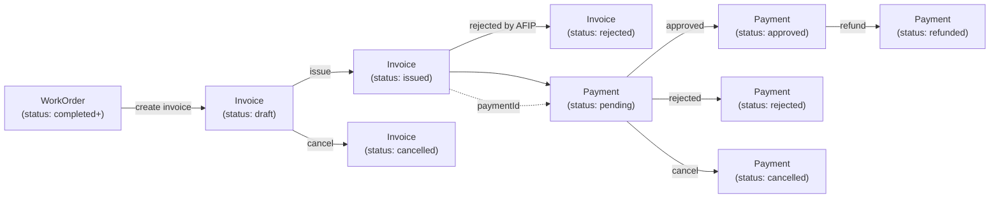

# Flujo 03: Facturacion y Pagos (Invoice + Payment)

Cubre la cadena de revenue del sistema: emitir facturas (AFIP A/B/C),
registrar pagos (con o sin cuotas), y mantener el estado financiero de
cada `WorkOrder`.

## Diagrama general

## 1. Invoice (Factura)

### Modelo

`Invoice` definido en `invoice.interfaces.ts:1-57`:

- `InvoiceType`: `'A' | 'B' | 'C'` (AFIP, regimen argentino).
- `InvoiceStatus`: `'draft' | 'issued' | 'cancelled' | 'rejected'`.
- `InvoiceConcept`: `'products' | 'services' | 'both'`.
- `workOrderId: string` (`invoice.interfaces.ts:28`) - relacion
  con la WO.
- Campos impositivos: `clientCuit`, `clientAddress`,
  `clientIvaCondition`, `ivaAmount`.

### Ciclo de vida

| Estado | Descripcion | Transiciones validas |
|---|---|---|
| `draft` | Borrador, editable. | `issue` (a `issued`) o `cancel` (a `cancelled`). |
| `issued` | Validada por AFIP, tiene PDF. | `reject` externo (a `rejected`). |
| `cancelled` | Anulada. | terminal. |
| `rejected` | Rechazada por AFIP. | terminal. |

### API (`billing.service.ts:1`)

- `GET /api/billing/invoices` con filtros
  (`status`, `invoiceType`, `dateFrom`, `dateTo`, `clientName`).
- `GET /api/billing/invoices/:id`.
- `POST /api/billing/invoices` con payload completo
  (incluye `invoiceType`, `clientCuit`, `concept`, `subtotal`,
  `ivaAmount`, `total`, `workOrderId`, `paymentId?`).
- `POST /api/billing/invoices/:id/issue` - confirma y envia a AFIP.
- `POST /api/billing/invoices/:id/cancel`.
- `GET /api/billing/invoices/:id/pdf` - descarga PDF pre-generado (BFF
  pattern, ver AGENTS.md "Decisiones de Dominio").

## 2. Payment (Pago)

### Modelo

`Payment` definido en `payment.interfaces.ts:1-55`:

- `PaymentMethod`: `'credit_card' | 'debit_card' | 'cash' | 'transfer'`.
- `PaymentStatus`: `'pending' | 'approved' | 'rejected' | 'refunded' | 'cancelled'`.
- `workOrder: { id, trackingCode }` (`payment.interfaces.ts:18-21`) -
  anidado, no FK suelta.
- Cuotas: `installmentNumber?` + `totalInstallments?`
  (`payment.interfaces.ts:6-7`).
- `provider: string` (MercadoPago, banco, etc.).
- `paidAt?: string` - timestamp de aprobacion.

### Ciclo de vida

| Estado | Descripcion | Transiciones validas |
|---|---|---|
| `pending` | Creado, esperando aprobacion. | `approved`, `rejected`, `cancelled`. |
| `approved` | Acreditado. | `refunded` (devolucion). |
| `rejected` | Rechazado por provider. | terminal. |
| `refunded` | Devuelto al cliente. | terminal. |
| `cancelled` | Anulado antes de acreditar. | terminal. |

### API (`payments.service.ts:1`)

- `POST /api/work-orders/{id}/payments` - **endpoint anidado bajo
  work-order** (`payments.service.ts:33-35`). El `workOrderId` viene
  en la URL, no en el body.
- `GET /api/payments?workOrderId=...&status=...&method=...`.
- `PATCH /api/payments/:id`.
- `DELETE /api/payments/:id`.

## ⚠️ Gap de integracion (importante)

`features/work-orders/` **no importa `BillingService`**. No existe
logica en el frontend que cree automaticamente una `Invoice` cuando una
WO pasa a `completed`. La asociacion `workOrderId` es solo una FK
persistida por el backend; ambos modulos operan de forma independiente.

Esto significa:

- El operario debe ir manualmente a `/admin/billing` y crear la
  factura, eligiendo la WO desde un selector.
- No hay validacion UI de que una WO en `completed` sin factura quede
  en estado de atencion.
- El modulo `portal` (ver [04-realtime-notifications.md](./04-realtime-notifications.md))
  muestra "resumen de pagos" pero **no permite pagar** desde el portal;
  solo ver estado.

## Notificaciones asociadas

`NotificationType` events (`notification.interfaces.ts:1-22`):

- `PAYMENT_CREATED` - al crear un Payment en `pending`.
- `PAYMENT_APPROVED` - al transicionar a `approved`.
- `PAYMENT_REJECTED` - al transicionar a `rejected`.

## Portal publico

`features/portal/portal-payment-summary.component.ts:1` muestra el
resumen de pagos al cliente final (consulta por `trackingCode`). Es
**read-only**: el cliente no puede iniciar pagos desde el portal.

## Multi-tenancy / Marketplace (no implementado)

- `Invoice.clientCuit` permite multi-cliente dentro de la misma WO.
- `Payment.provider` es string libre; no hay catalogo normalizado de
  providers (MercadoPago, Stripe, etc.).
- No hay integracion real con MercadoPago SDK; el `provider` se setea
  manualmente.

## Referencias en codigo

| Concepto | Ubicacion |
|---|---|
| Modelo `Invoice` + enums | `src/app/core/models/invoice.interfaces.ts:1` |
| `InvoiceType` (A/B/C) | `src/app/core/models/invoice.interfaces.ts:1` |
| `InvoiceStatus` enum | `src/app/core/models/invoice.interfaces.ts:2` |
| `InvoiceConcept` enum | `src/app/core/models/invoice.interfaces.ts:3` |
| `workOrderId` en Invoice | `src/app/core/models/invoice.interfaces.ts:28` |
| `billing.service.ts` (API `/api/billing/invoices`) | `src/app/core/services/billing.service.ts:1` |
| Lista de facturas | `src/app/features/billing/invoices-list.component.ts:1` |
| Detalle de factura | `src/app/features/billing/invoice-detail.component.ts:1` |
| Form crear/editar factura | `src/app/features/billing/invoice-form.component.ts:1` |
| Modelo `Payment` + enums | `src/app/core/models/payment.interfaces.ts:1` |
| `PaymentMethod` enum | `src/app/core/models/payment.interfaces.ts:1` |
| `PaymentStatus` enum | `src/app/core/models/payment.interfaces.ts:2` |
| `workOrder` anidado en Payment | `src/app/core/models/payment.interfaces.ts:18` |
| `installmentNumber` + `totalInstallments` | `src/app/core/models/payment.interfaces.ts:6` |
| `payments.service.ts` (CRUD payments) | `src/app/core/services/payments.service.ts:1` |
| `create(workOrderId, dto)` (endpoint anidado) | `src/app/core/services/payments.service.ts:33` |
| Lista de pagos | `src/app/features/payments/payments-list.component.ts:1` |
| Form crear/editar pago | `src/app/features/payments/payment-form.component.ts:1` |
| Resumen de pagos en portal publico | `src/app/features/portal/portal-payment-summary.component.ts:1` |
