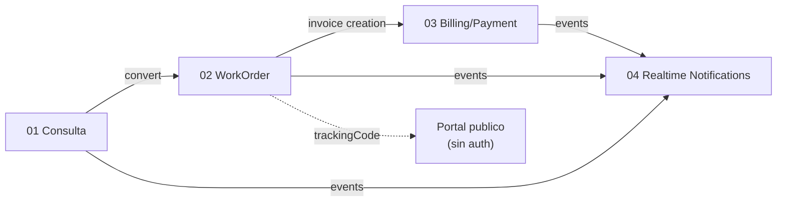

# Flujos de Negocio

Documentacion de los procesos de negocio transversales del sistema Tech
Service. Cada flujo se documenta en su propio archivo con:

- Diagrama Mermaid (renderiza en GitHub, VSCode, OpenCode).
- Referencias `archivo:linea` al codigo real que lo implementa.
- Notas de discrepancias y gaps conocidos.

> **Principio:** la documentacion refleja la realidad del codigo, no
> disenos aspiracionales. Si hay conflicto, gana el codigo y se anota
> la discrepancia para resolver.

## Indice de flujos

| # | Flujo | Archivo | Estados clave |
|---|---|---|---|
| 01 | Consulta -> Pendiente -> Orden de Trabajo | [01-inquiry-workflow.md](./01-inquiry-workflow.md) | `new` `contacted` `reviewed` `approved` `rejected` `converted` |
| 02 | Ciclo de vida de la Orden de Trabajo | [02-workorder-lifecycle.md](./02-workorder-lifecycle.md) | `pending` `assigned` `on_the_way` `in_progress` `postponed` `completed` `delivered` `cancelled` |
| 03 | Facturacion y Pagos (Invoice + Payment) | [03-billing-payment.md](./03-billing-payment.md) | Invoice: `draft` `issued` `cancelled` `rejected`. Payment: `pending` `approved` `rejected` `refunded` `cancelled` |
| 04 | Notificaciones en tiempo real (Socket.IO + Push) | [04-realtime-notifications.md](./04-realtime-notifications.md) | 21 eventos `NotificationType` |

## Diagrama de relacion entre flujos

## Convenciones

- Numeracion con prefijo `NN-` para mantener orden lexicografico.
- Diagramas sin emojis en nodos (compatibilidad con renderers).
- Campos enum siempre entre comillas invertidas: `pending`, no pending.
- Tabla de referencias al final de cada archivo con `archivo:linea`.

## Regla de crecimiento

Cuando un nuevo flujo agregue valor transversal y supere ~80 lineas de
documentacion, va en un nuevo archivo `NN-nombre.md` y se actualiza
este README. Si la seccion de un flujo existente en un archivo crece
mas alla de ~300 lineas, considerar dividir.
